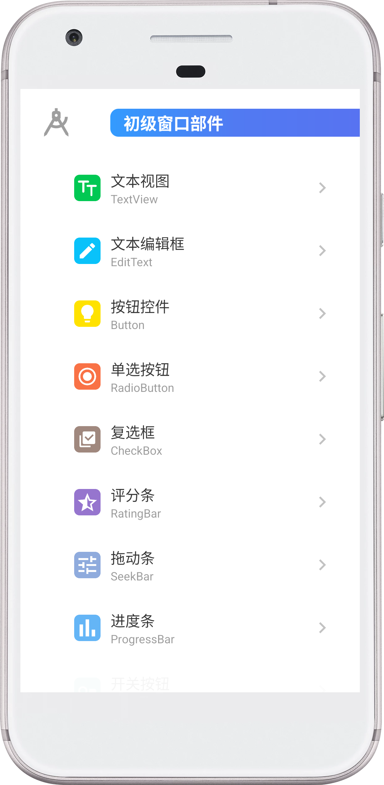

# Where

## An app for Android beginners
### I showed Pipifan my APP source code, and he realized the magic of JAVA, and then immediately went to training to learn it, but now he says he doesn’t quite recognize me, and he likes playing with the puppy very much, what should I do? I can’t find a solution, and I’m now seeking help from all over the world ...

<!--  -->
