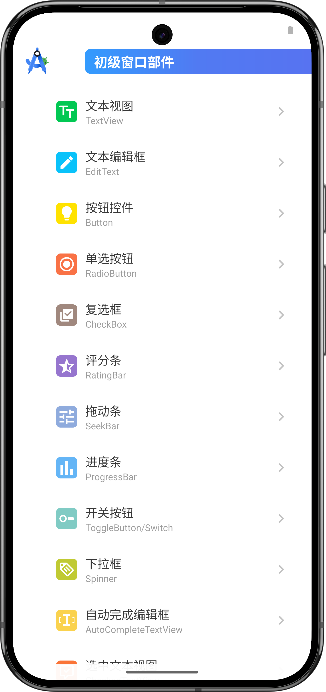
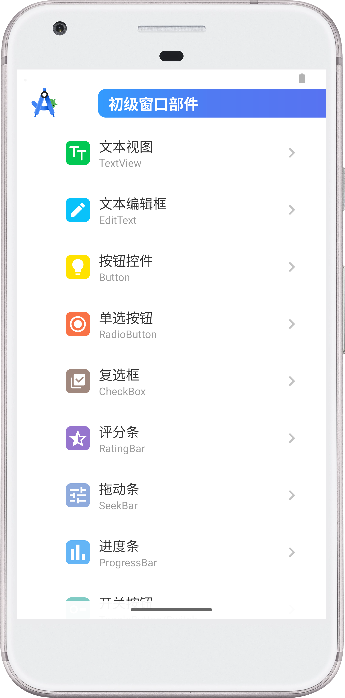
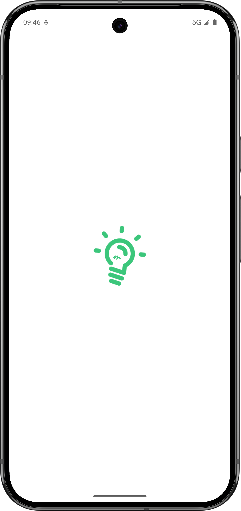

# Where

## An app for Android beginners

&emsp;&emsp;&emsp;&emsp;&emsp;&emsp;

<!--  -->

### If you like this project very much from the bottom of your heart, you can use Alipay to scan the following QR code to donate to the author:

<picture><source media="(prefers-color-scheme: dark)" srcset="./AlipayDark.svg"><source media="(prefers-color-scheme: light)" srcset="./Alipay.svg"></picture>
